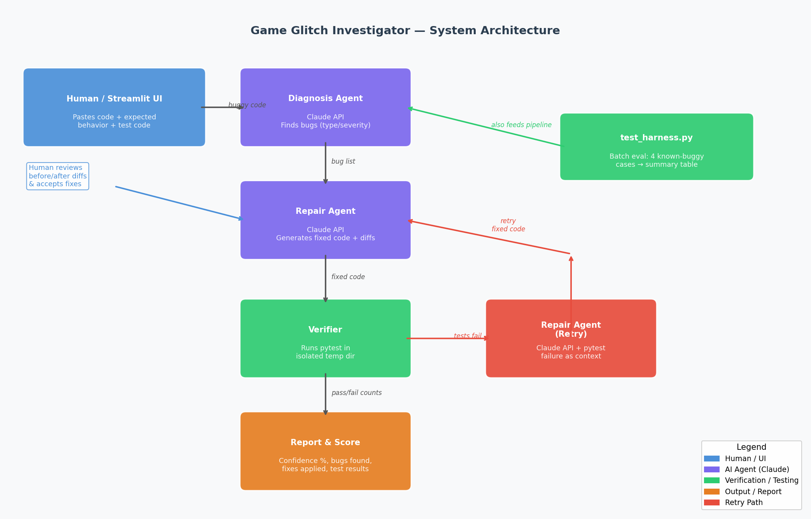

# Game Glitch Investigator — AI Code Debugger

> **Original Project (Modules 1–3):** Game Glitch Investigator — a deliberately
> buggy Python number guessing game built with Streamlit. The original goal was
> to practice debugging by finding and fixing seven real bugs: wrong hints,
> broken scoring, missing state persistence, off-by-one errors, and type
> mismatches. Logic was then refactored into `logic_utils.py` and covered by
> a pytest suite.

## Summary

An AI-powered code debugging pipeline that automatically diagnoses, repairs,
and verifies bugs in Python code. Users paste buggy code into a Streamlit
interface; Claude finds bugs, proposes fixes, runs pytest to verify correctness,
and reports a confidence score.

**AI feature:** Agentic Workflow — the system plans and executes a multi-step
pipeline (diagnose → repair → verify → retry if needed) and checks its own work
by running tests, then adjusts if they fail.

## Loom Video Walkthrough

> 🎬 **[INSERT LOOM VIDEO LINK HERE]**

## Architecture Overview



```
User Input (Streamlit)
    |  buggy code + optional expected behavior + optional test code
    v
+---------------------+
|   DiagnosisAgent    |  <- Claude API (structured JSON)
|  location / type /  |     location, bug_type, severity, description
|  severity / desc    |
+----------+----------+
           | bug list
           v
+---------------------+
|    RepairAgent      |  <- Claude API (structured JSON)
|  fixed_code +       |     original/fixed snippets + explanations
|  per-bug diffs      |
+----------+----------+
           | fixed_code
           v
+---------------------+     +----------------------+
|  Verification Layer |---->|  RepairAgent (retry) |  ONE retry with
|  pytest in tmpdir   |     |  + test failure ctx  |  pytest output
+----------+----------+     +----------------------+
           | pass/fail counts
           v
+---------------------+
|   Report + Score    |  Confidence = % passing (x0.7 penalty for retry)
+---------------------+
```

**Components:**

| File | Role |
|------|------|
| [`app.py`](app.py) | Streamlit UI with expandable stage-by-stage output |
| [`agents.py`](agents.py) | `DiagnosisAgent` and `RepairAgent` (Anthropic SDK, prompt caching) |
| [`verifier.py`](verifier.py) | Runs pytest in isolated temp directories |
| [`test_harness.py`](test_harness.py) | Batch evaluation across 4 known-buggy test cases |
| [`test_cases/`](test_cases/) | 4 sample buggy files + matching pytest test files |

## Setup Instructions

1. **Clone the repo:**
   ```bash
   git clone https://github.com/0bafemi/AI-Code-Debugger.git
   cd AI-Code-Debugger
   ```

2. **Install dependencies:**
   ```bash
   pip install -r requirements.txt
   ```

3. **Set your Anthropic API key:**
   ```bash
   # macOS / Linux
   export ANTHROPIC_API_KEY=your_key_here
   # Windows
   set ANTHROPIC_API_KEY=your_key_here
   ```

4. **Run the app:**
   ```bash
   streamlit run app.py
   ```

5. **Run the batch test harness (optional):**
   ```bash
   python test_harness.py
   ```

## Sample Interactions

### Example 1 — Wrong comparison operator

**Input code:**
```python
def is_adult(age):
    return age > 18  # excludes exactly 18
```

**Diagnosis output:**
- Bug in `is_adult` — logic — Uses strict `>` instead of `>=`, so age 18 is
  incorrectly excluded — severity: medium

**Repair output:**
- Before: `return age > 18`
- After:  `return age >= 18`
- Explanation: Changed `>` to `>=` so age 18 is correctly included as an adult.

**Test result:** 3/3 passed · Confidence: 100%

---

### Example 2 — Scoring bug (from original game)

**Input code:**
```python
def update_score(current_score, outcome, attempt_number):
    if outcome == "Win":
        return current_score + max(100 - 10 * attempt_number, 10)
    return current_score + 5  # should subtract
```

**Diagnosis:** Logic bug in `update_score` — wrong guesses add 5 points instead
of subtracting — severity: high

**Repair:** Changed `+ 5` to `- 5`. Tests: 4/4 passed · Confidence: 100%

---

### Example 3 — Type mismatch

**Input code:**
```python
def format_score(score):
    return score + "%"  # TypeError at runtime
```

**Diagnosis:** Runtime bug — cannot concatenate int and str with `+`

**Repair:** Changed to `return str(score) + "%"`. Tests: 2/2 passed ·
Confidence: 100%

## Design Decisions

| Decision | Rationale |
|---|---|
| Structured JSON responses | Guarantees reliable parsing over free-form text |
| Prompt caching on system prompts | Reduces API cost across the repeated diagnose → repair → retry calls |
| Temp directory isolation in verifier | Fixed code never touches project files; cleanup is automatic |
| Single retry limit | Balances thoroughness with cost — most fixable bugs succeed on retry |
| Confidence penalty (x0.7) for retry | Distinguishes first-pass quality from retry quality |
| Tests import from `solution` | Keeps verifier simple; one convention instead of rewriting imports |

## Testing Summary

> Run `python test_harness.py` to reproduce.

| Test Case | Bugs Found | Tests | Status |
|---|---|---|---|
| Wrong Comparison Operator | 2 | 6/6 | PASS |
| Off-by-One Error | 2 | 4/4 | PASS |
| Type Mismatch | 2 | 4/4 | PASS |
| Scoring Logic Bug | 1 | 4/4 | PASS |

**What worked:** Structured JSON prompts made parsing reliable. The retry
mechanism caught cases where the first fix was syntactically correct but
semantically incomplete.

**What didn't:** The AI occasionally over-diagnosed (flagged style as bugs).
JSON responses sometimes included markdown fences that required stripping before
parsing.

**What I learned:** Prompt precision matters enormously — explicit format
requirements in the system prompt reduced parse errors significantly. Testing
the AI against known-buggy inputs is the only reliable way to measure
reliability.

## Reflection

Building this system taught me that AI reliability is not binary. The same model
that perfectly fixes a scoring bug can hallucinate an "issue" with a correct
comparison operator. Structured prompts with explicit JSON schemas dramatically
reduced that variability — but didn't eliminate it. The test harness was the key
insight: running the pipeline against known-buggy inputs gave me concrete
pass/fail evidence instead of subjective impressions of whether it "seemed to
work."

The agentic retry loop was the most instructive part to design. The first version
just re-sent the same prompt — it failed the same way every time. Feeding the
actual pytest error output back to the model changed the behavior entirely: the
model could reason about *why* the fix broke rather than guessing again. That
taught me that AI agents need structured feedback, not just a second chance.

The biggest trade-off I made was limiting retries to one. More retries would
improve the pass rate but increase cost and latency unpredictably. One retry
strikes the right balance for a demo system, and the confidence penalty (×0.7)
honestly reflects that a fix needing a retry is lower quality than one that
passes first time.

> For detailed ethics, bias analysis, and AI collaboration examples, see
> [model_card.md](model_card.md).

---

*Built on [Claude](https://anthropic.com) (claude-sonnet-4-6) ·
Streamlit · pytest*
